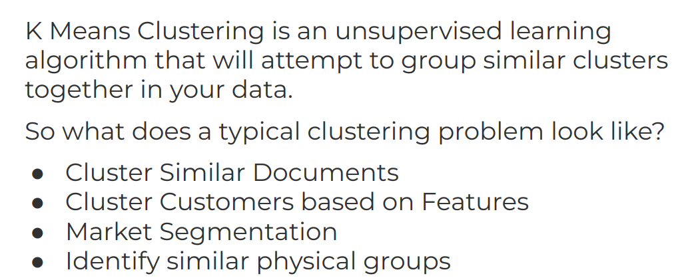
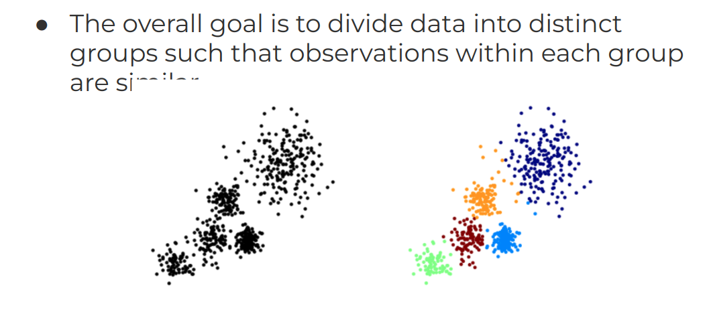
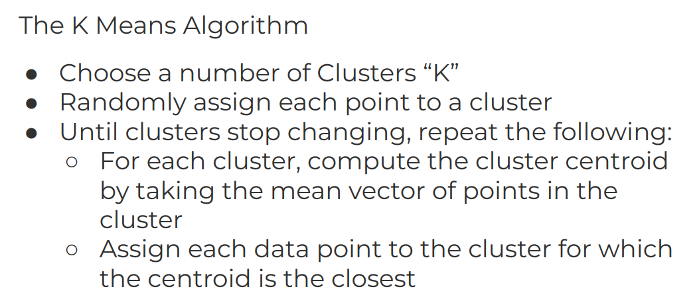
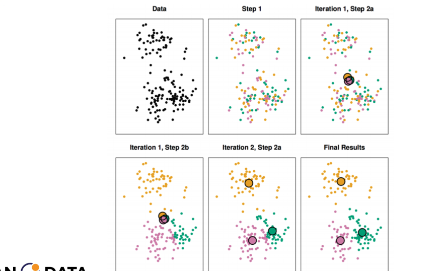
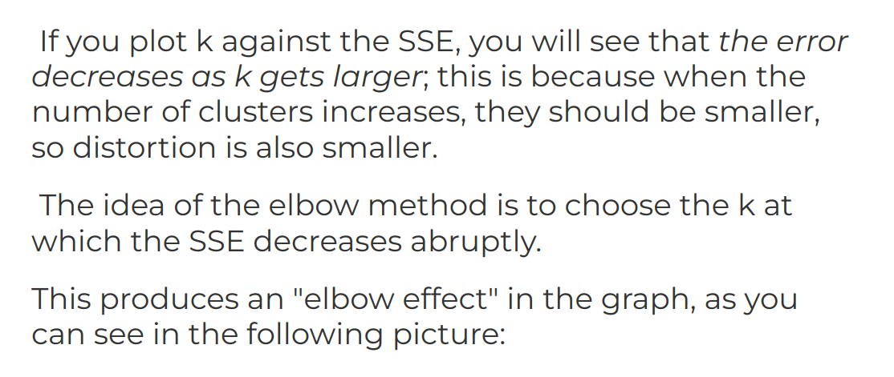
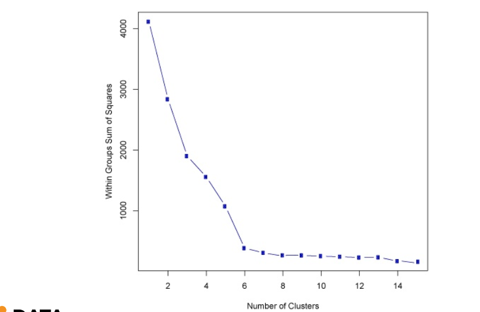
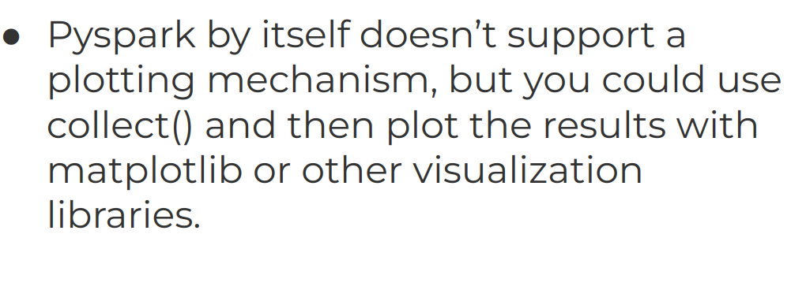

# 8-K-means-Clustering
1. [K-means Clustering Theory and Reading](#schema1)
2. [KMeans Clustering Documentation Example](#schema2)


<hr>

<a name="schema1"></a>

## 1. K-means Clustering Theory and Reading











<hr>

<a name="schema2"></a>

## 2. KMeans Clustering Documentation Example

# Clustering Documentation Example

<h2 id="k-means">K-means</h2>

<p><a href="http://en.wikipedia.org/wiki/K-means_clustering">k-means</a> is one of the
most commonly used clustering algorithms that clusters the data points into a
predefined number of clusters. The MLlib implementation includes a parallelized
variant of the <a href="http://en.wikipedia.org/wiki/K-means%2B%2B">k-means++</a> method
called <a href="http://theory.stanford.edu/~sergei/papers/vldb12-kmpar.pdf">kmeans||</a>.</p>

<p><code>KMeans</code> is implemented as an <code>Estimator</code> and generates a <code>KMeansModel</code> as the base model.</p>

<h3 id="input-columns">Input Columns</h3>

<table class="table">
  <thead>
    <tr>
      <th align="left">Param name</th>
      <th align="left">Type(s)</th>
      <th align="left">Default</th>
      <th align="left">Description</th>
    </tr>
  </thead>
  <tbody>
    <tr>
      <td>featuresCol</td>
      <td>Vector</td>
      <td>"features"</td>
      <td>Feature vector</td>
    </tr>
  </tbody>
</table>

<h3 id="output-columns">Output Columns</h3>

<table class="table">
  <thead>
    <tr>
      <th align="left">Param name</th>
      <th align="left">Type(s)</th>
      <th align="left">Default</th>
      <th align="left">Description</th>
    </tr>
  </thead>
  <tbody>
    <tr>
      <td>predictionCol</td>
      <td>Int</td>
      <td>"prediction"</td>
      <td>Predicted cluster center</td>
    </tr>
  </tbody>
</table>

-  Cargar los datos
```
dataset = spark.read.format('libsvm').load('./data/sample_kmeans_data.txt')
```

```
dataset.show()
+-----+--------------------+
|label|            features|
+-----+--------------------+
|  0.0|           (3,[],[])|
|  1.0|(3,[0,1,2],[0.1,0...|
|  2.0|(3,[0,1,2],[0.2,0...|
|  3.0|(3,[0,1,2],[9.0,9...|
|  4.0|(3,[0,1,2],[9.1,9...|
|  5.0|(3,[0,1,2],[9.2,9...|
+-----+--------------------+
```
- Seleccionamos las columnas necesarias
```
final_data = dataset.select('features')
```
- Crear el modelo

```
kmeans = KMeans().setK(2).setSeed(1)
```
-  Entrenar el modelo
```
model = kmeans.fit(final_data)
```
- En el curso usa esto pero está deprecado
```
wssse = model.computeCost(final_data)
---------------------------------------------------------------------------
AttributeError Traceback (most recent call last)
<ipython-input-10-8a4a73817df7> in <module> ----> 1 wssse = model.computeCost(final_data)
AttributeError: 'KMeansModel' object has no attribute 'computeCost'
```
- Mejor usar esto
```
from pyspark.ml.evaluation import ClusteringEvaluator
# Predecir las asignaciones de clúster para los datos
predictions = model.transform(final_data)

# Calcular la suma de los cuadrados de las distancias
evaluator = ClusteringEvaluator()
silhouette = evaluator.evaluate(predictions)
print("Silhouette with squared euclidean distance = " + str(silhouette))

Silhouette with squared euclidean distance = 0.9997530305375207
```


